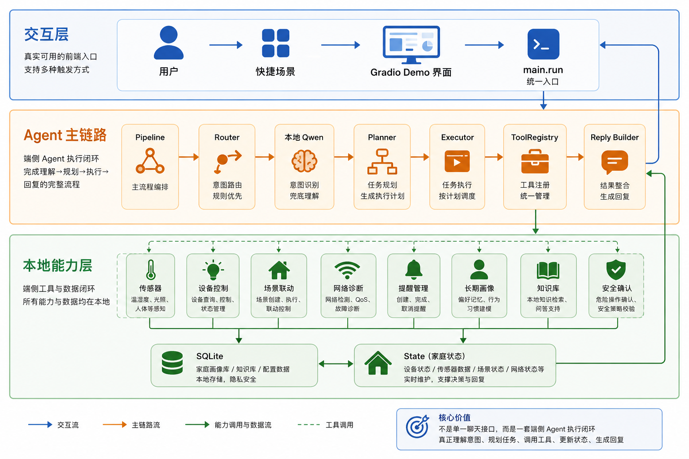
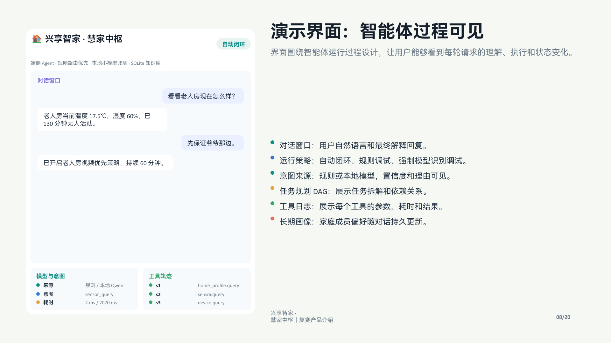
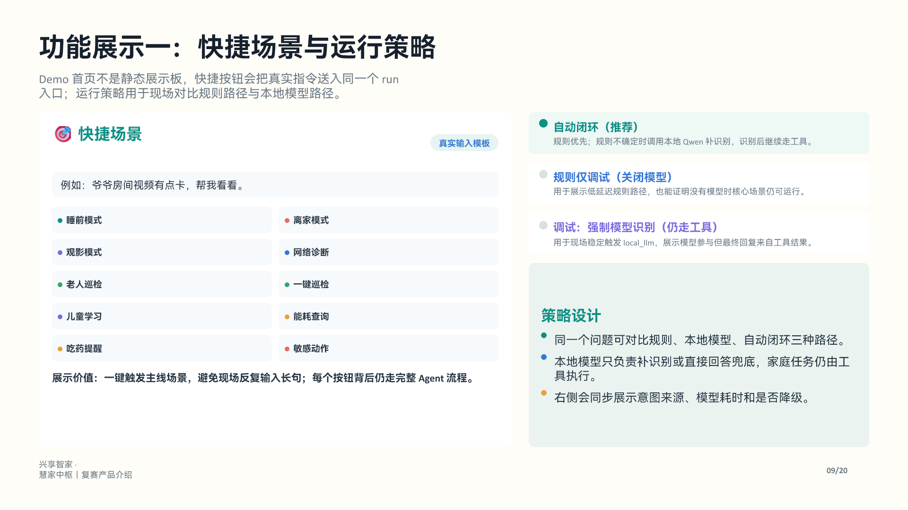
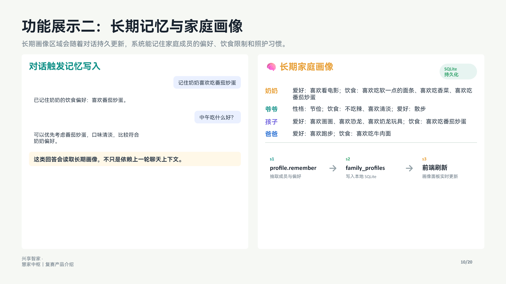
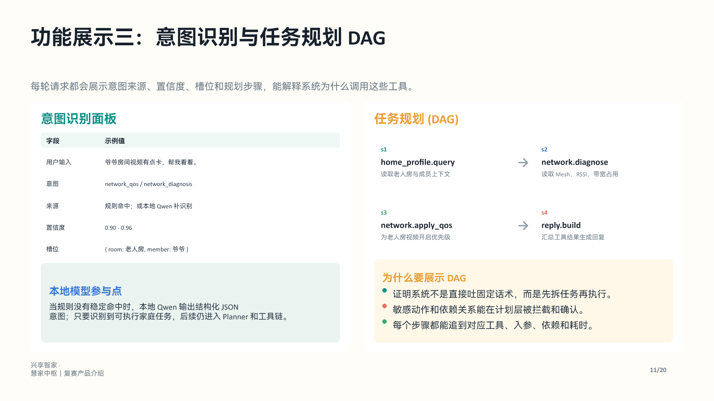
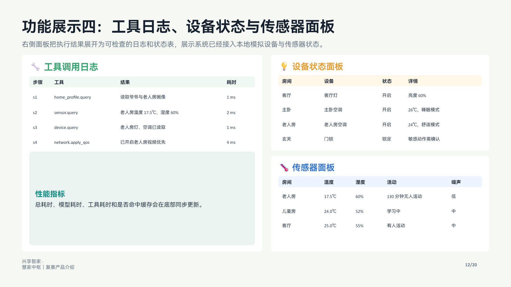

# 兴享智家·慧家中枢

面向三代同堂家庭的端侧家庭智能体 Demo。系统通过规则优先、本地 Qwen 小模型兜底、SQLite 长期记忆和白名单工具调用，把自然语言转成可执行的家庭任务闭环。

它不是单纯聊天入口，而是一套本地 Agent 执行链：理解意图、规划任务、调用工具、更新家庭状态、生成可解释回复。

## 核心能力

- **场景理解与任务规划**：睡前模式、离家模式、观影模式、儿童学习模式等。
- **工具调用与资源整合**：设备控制、网络诊断、QoS、提醒、传感器、能耗、知识库、长期画像。
- **多轮对话与状态保持**：支持网络诊断后的 QoS 跟进、敏感动作二次确认、普通生活问答追问。
- **端侧高效运行**：本地 GGUF 模型、本地 SQLite、本地工具执行，核心流程不依赖云 API。

## 系统架构



系统分为三层：

1. **交互层**：用户通过快捷场景或 Gradio Demo 输入自然语言，统一进入 `main.run`。
2. **Agent 主链路**：`Pipeline -> Router -> 本地 Qwen -> Planner -> Executor -> ToolRegistry -> Reply Builder`，完成理解、规划、执行和回复。
3. **本地能力层**：传感器、设备控制、场景联动、网络诊断、提醒管理、长期画像、知识库、安全确认、SQLite 和 State 全部在本地闭环。

## Demo 功能截图

### 1. 演示界面：智能体过程可见



界面展示对话窗口、模型与意图、工具轨迹和任务规划，让评委能看到系统每轮请求的理解、执行和状态变化。

### 2. 快捷场景与运行策略



快捷按钮会把真实自然语言指令送入同一个 `run` 入口；运行策略支持自动闭环、规则调试和强制本地模型识别调试。

### 3. 长期记忆与家庭画像



系统可以记住家庭成员的性格、爱好和饮食偏好，并持久化到 SQLite。后续饮食建议、照护建议会参考这些长期画像。

### 4. 意图识别与任务规划 DAG



每轮请求都会展示意图来源、置信度、槽位和任务规划 DAG，解释系统为什么调用这些工具。

### 5. 工具日志、设备状态与传感器面板



工具调用日志、设备状态和传感器数据会随着任务执行同步更新，证明系统不是固定话术，而是真实走了本地工具链。

## 项目结构

```text
main.py                         比赛要求的 run 入口
smart_home_agent/               Agent 核心代码
  core/                         Router / Planner / Executor
  tools/                        ToolRegistry 与家庭工具
  memory/                       SQLite 知识库、长期画像、会话记忆
  providers/                    本地 LLM 提供方
demo/app.py                     Gradio 演示界面
tests/test_scenarios.py         场景烟雾测试
zhijia/docs/                    需求、接口、实现方案文档
pptx_work/                      复赛 PPT 生成脚本与最终 PPT
docs/assets/                    README 展示图片
qa.md                           答辩问答库
复赛技术说明文档.md              技术说明文档
```

## 安装

建议使用 Python 3.10+。

```powershell
python -m pip install -e ".[demo]"
python -m pip install "llama-cpp-python==0.3.19" --extra-index-url https://abetlen.github.io/llama-cpp-python/whl/cpu --prefer-binary
```

## 本地模型

GitHub 仓库不包含 `smart_home_agent/data/qwen2.5-1.5b-instruct-q4_k_m.gguf`，因为模型文件约 940MB。运行本地模型前请下载：

```powershell
python scripts\download_model.py
```

也可以手动下载 Qwen2.5-1.5B-Instruct Q4_K_M GGUF，并放到：

```text
smart_home_agent/data/qwen2.5-1.5b-instruct-q4_k_m.gguf
```

没有模型文件时，规则路径、工具调用、SQLite 知识库和长期画像仍可运行；只是本地模型识别和直接回答兜底不可用。

## 运行 Demo

```powershell
python demo\app.py
```

浏览器打开：

```text
http://127.0.0.1:7860/
```

## 命令行调用

```powershell
python main.py "爸妈准备睡了，帮我切到睡前模式，顺便检查一下门锁。"
```

也可以在 Python 中调用：

```python
from main import run

result = run("爷爷房间视频有点卡，帮我看看。")
print(result["reply"])
```

## 测试

```powershell
$env:PYTHONIOENCODING="utf-8"
python tests\test_scenarios.py
```

期望输出：

```text
all scenario tests passed
```

## 当前边界

- 当前设备、网络和传感器为本地模拟数据，方便比赛现场稳定演示。
- `home_tools.py` 的模拟工具可以替换成 Matter、MQTT、Home Assistant、路由器 API 等真实接口。
- 长期家庭画像和本地知识库保存在 SQLite 中，运行时数据库文件不会提交到 GitHub。
- 本地模型为 CPU 推理，首次加载和生成速度取决于运行机器。
