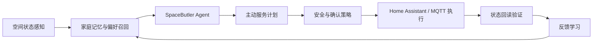

# SpaceButler 技术方案

## 架构

## 技术路线

- Python Agent 内核负责空间状态、记忆、主动策略和计划生成。
- Home Assistant 作为唯一设备服务调用边界。
- MQTT + SQLite 设备模拟器提供可复现演示和验收证据。
- 本地边缘大模型负责自然语言交互、意图理解和复杂场景补全。
- 所有设备动作进入白名单、安全校验和执行后状态回读。

## 安全隐私

- 偏好学习默认基于用户显式反馈。
- 受保护设备需要二次确认。
- Token、模型和真实家庭数据不进入提交材料。
- 演示数据使用本地模拟器和脱敏证据。

